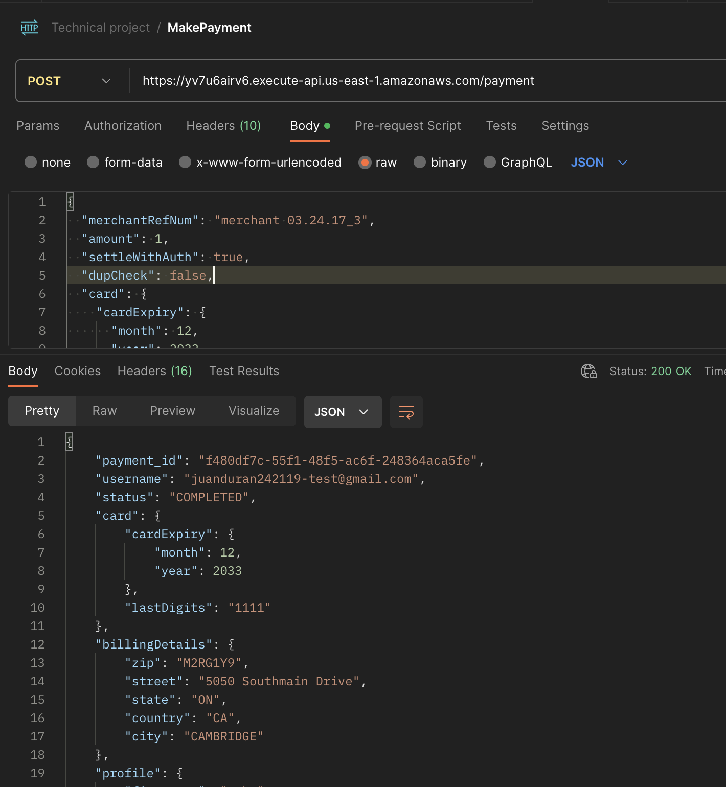

### Technical-project

# Service used 

The aws service was used to allocate the code resources

The main reasons for using this cloud service were the following:
- AWS API Gateway allows creating and making the authorization flow easy and scalable
- It provides a NoSQL database to store all the information
- AWS Secret Manager made it possible to store the confidential API keys to use in the code
- Allow to have logs of the lambda executions with prints inside the code

You can see the arch of the system in the next diagram


## Improvements
- Improve the authorization flow to avoid saving the password in dynamo (Currently it is saved as a hash to avoid saving plain text)
- Allow refunds (This was not done due to lack of time)
- Make the flow asynchronous, this will allow retries in case any of the aws services fail
- Include aws resources in the repo and not use the console
- Include test in the all lambdas and pay safe method

### Postman collection link
https://api.postman.com/collections/10079251-8ad66fc7-723e-4812-8ccb-4b547d2dc87d?access_key=PMAT-01J4YT7JNKQVD2QWGRTY4NQZ6E

## Postman steps:
- [**CREATE USER**] Create the user to have credential to access to the system (https://yv7u6airv6.execute-api.us-east-1.amazonaws.com/user)

- [**MAKE PAYMENT**] Make the first payment with the new credential (https://yv7u6airv6.execute-api.us-east-1.amazonaws.com/payment)
  
  The example body to use this endpoint
    ```
    {
      "merchantRefNum": "merchant 03.24.17_3",
      "amount": 1,
      "settleWithAuth": true,
      "dupCheck": false,
      "card": {
        "cardExpiry": {
          "month": 12,
          "year": 2033
        },
        "cvv": "123",
        "cardNum": "4111111111111111"
      },
      "billingDetails": {
        "zip": "M2RG1Y9",
        "street": "5050 Southmain Drive",
        "state": "ON",
        "country": "CA",
        "city": "CAMBRIDGE"
      },
      "preAuth": true,
      "profile": {
        "firstName": "John",
        "lastName": "Doe",
        "email": "AY1@OPTIMAL.COM"
      },
      "authentication": {
        "exemptionIndicator": "LOW_VALUE_EXEMPTION"
      }
    }
    ```  
  

    In the next link you can find another credit cards, cvv numbers and amount to test 
    - https://developer.paysafe.com/en/api-docs/cards/test-and-go-live/simulating-cvv-responses/
    - https://developer.paysafe.com/en/api-docs/cards/test-and-go-live/simulating-card-payments/
- [**GET PAYMENT**] Allows to get the all payments or a specific one (https://yv7u6airv6.execute-api.us-east-1.amazonaws.com/payment?payment_id)
  